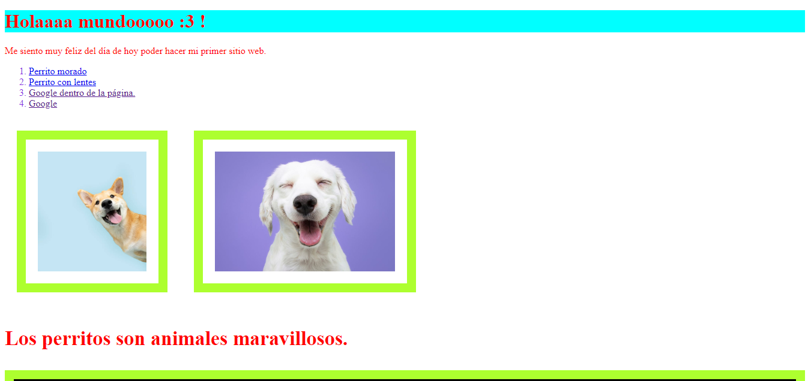

# Mi segunda página web de Tecnolochicas PRO

Esta página web fue desarrollada para comenzar a utilizar HTML y CSS dentro del Bootcamp de desarrollo front-end de Tecnolochicas.

Fue desarrollado con HTML y CSS.

[Proyecto en línea](https://fluffy-starlight-dac3bd.netlify.app/)

- Capturas de pantalla

- Tecnologías

* HTML
* CSS

- Creado por Maria Xitlali Valenzo Serna en el bootcamp de Tecnolochicas Pro